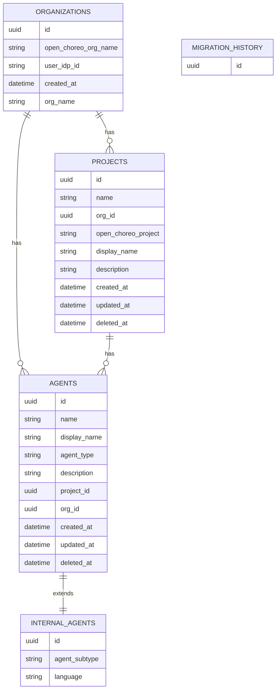

```mermaid
erDiagram
    ORGANIZATIONS {
        uuid id
        string open_choreo_org_name
        string user_idp_id
        datetime created_at
        string org_name
    }

    PROJECTS {
        uuid id
        string name
        uuid org_id
        string open_choreo_project
        string display_name
        string description
        datetime created_at
        datetime updated_at
        datetime deleted_at
    }

    AGENTS {
        uuid id
        string name
        string display_name
        string agent_type
        string description
        uuid project_id
        uuid org_id
        datetime created_at
        datetime updated_at
        datetime deleted_at
    }

    INTERNAL_AGENTS {
        uuid id
        string agent_subtype
        string language
    }

    MIGRATION_HISTORY {
        uuid id
    }

    %% Relationships
    ORGANIZATIONS ||--o{ PROJECTS : has
    ORGANIZATIONS ||--o{ AGENTS : has
    PROJECTS ||--o{ AGENTS : has
    AGENTS ||--|| INTERNAL_AGENTS : extends

```
